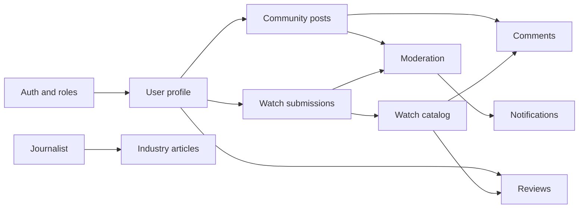

# WatchWeb


WatchWeb is a full-stack web application for watch enthusiasts. It combines a community portal, industry articles, a watch catalog, reviews, comments, content moderation, notifications, and an admin panel.

The repository is designed as a portfolio/CV project. It demonstrates practical use of modern Java, Spring Boot, React, TypeScript, PostgreSQL, database migrations, JWT-based authentication, role-based authorization, file uploads, and integration testing.

## Key features

- User registration and login with JWT access tokens and refresh tokens.
- Role-based access control with `ROLE_USER`, `ROLE_JOURNALIST`, `ROLE_MODERATOR`, and `ROLE_ADMIN`.
- Public watch catalog with filtering by brand, movement type, case diameter, and water resistance.
- Watch catalog submissions with moderation, approval, rejection reason, and user-facing status tracking.
- Community posts with drafts, rich-text editing, images, hashtags, and moderation workflow.
- Post moderation with approval, rejection reason, and notifications for the author.
- Industry articles for journalists with drafts, publishing, rich-text content, and header images.
- Watch reviews with ratings from 1 to 10 and automatically maintained average rating and review count.
- Threaded comments for watches and posts with maximum depth and soft delete.
- User profile management, avatar upload, profile editing, password change, and account anonymization.
- Notification center for moderation decisions.
- Admin panel for user role management.
- OpenAPI / Swagger UI documentation for the REST API.

## Tech stack

| Area | Technologies |
| --- | --- |
| Backend | Java 25, Spring Boot 4.1, Spring MVC, Spring Security |
| API | REST, OpenAPI 3, Swagger UI |
| Authentication | JWT, refresh tokens, BCrypt, role-based access control |
| Database | PostgreSQL, Spring Data JPA, Hibernate, Flyway |
| Frontend | React 19, TypeScript, Vite, React Router |
| State and forms | TanStack Query, React Hook Form, Zod |
| UI | Tailwind CSS, shadcn/ui-style components, lucide-react |
| File handling | `StorageService` abstraction, local storage for development |
| Testing | JUnit 5, Testcontainers |
| DevOps | Docker Compose, Nginx for frontend hosting and `/api` reverse proxy |

## What this project demonstrates

- Feature-oriented backend architecture with package-by-feature organization.
- Clear separation between API DTOs and JPA entities.
- Explicit business rules for publishing, moderation, drafts, reviews, comments, and account handling.
- Role-based authorization enforced on the backend.
- Database schema versioning with Flyway migrations.
- Dynamic watch catalog filtering with JPA Specifications.
- Content lifecycle management: draft, pending moderation, published, rejected.
- File upload handling through a storage abstraction instead of storing binary data in the database.
- Integration tests using a real PostgreSQL database through Testcontainers.
- Frontend built with typed API calls, reusable UI components, responsive layouts, and consistent loading, error, and empty states.

## Architecture

The backend follows a domain-oriented structure instead of a traditional layer-based layout. Business logic is grouped under `domain/<feature>`, while global technical concerns such as configuration, security, storage, and exception handling live outside the domain packages.

```text
backend/src/main/java/com/watchweb/app
├── config
├── exception
├── infrastructure
│   └── storage
├── security
└── domain
    ├── article
    ├── auth
    ├── comment
    ├── hashtag
    ├── notification
    ├── post
    ├── review
    ├── user
    └── watch
```

The frontend uses a feature-oriented React structure:

```text
frontend/src
├── app
├── pages
├── features
├── entities
└── shared
```

Main dependency direction:

```text
app -> pages -> features -> entities -> shared
```

## Main application domains



## Local setup

The easiest way to run the full application is Docker Compose:

```powershell
docker compose up -d --build
```

After startup, the services are available at:

| Service | URL |
| --- | --- |
| Frontend | http://localhost:3000 |
| Backend API | http://localhost:8081/api |
| Swagger UI | http://localhost:8081/swagger-ui.html |
| OpenAPI JSON | http://localhost:8081/v3/api-docs |
| pgAdmin | http://localhost:5050 |
| PostgreSQL | localhost:5433 |

The frontend is served as a static application through Nginx. Requests to `/api/...` are proxied to the backend service.

## Demo accounts

The `dev` profile automatically loads seed data. All demo accounts use the same password:

```text
Password123
```

| Email | Role |
| --- | --- |
| `admin@watchweb.local` | administrator |
| `moderator@watchweb.local` | moderator |
| `journalist@watchweb.local` | journalist |
| `user@watchweb.local` | user |
| `collector@watchweb.local` | user |

## Useful commands

Backend:

```powershell
cd backend
.\mvnw.cmd test
```

Frontend:

```powershell
cd frontend
npm ci
npm run lint
npm run build
```

Full application:

```powershell
docker compose up -d --build
docker compose down
```

## Tests and quality

The backend includes integration tests for key areas of the application, including:

- authentication and refresh tokens,
- users and roles,
- posts and moderation,
- articles and drafts,
- watch catalog and submissions,
- reviews and rating statistics,
- comments,
- hashtags,
- file storage,
- development seed data.

The frontend is checked with ESLint and a production Vite/TypeScript build.

## Project status

WatchWeb is developed as a portfolio application. The main modules are implemented and can be run locally with Docker Compose. Natural next steps include frontend tests, end-to-end tests for the most important user flows, and a production-ready S3/MinIO storage implementation.
