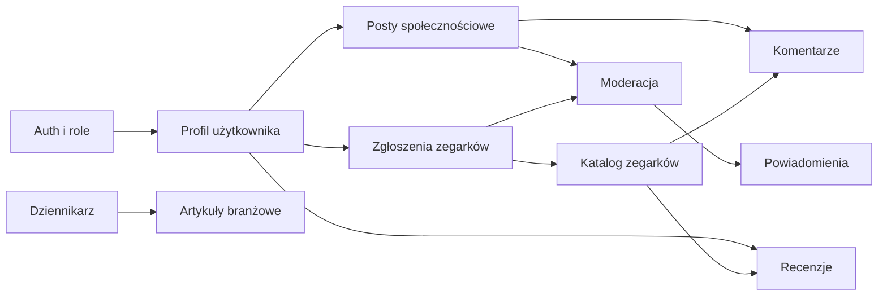

# WatchWeb


WatchWeb to pełna aplikacja webowa dla pasjonatów zegarków. Projekt łączy portal społecznościowy, blog branżowy, katalog modeli zegarków, recenzje, komentarze, moderację treści oraz panel administracyjny.

Repozytorium zostało przygotowane jako projekt portfolio/CV: pokazuje praktyczne użycie nowoczesnej Javy, Spring Boota, Reacta, TypeScriptu, PostgreSQL, migracji bazodanowych, autoryzacji JWT oraz testów integracyjnych.

## Najważniejsze funkcje

- Rejestracja, logowanie, JWT access token i refresh token.
- Role użytkowników: `ROLE_USER`, `ROLE_JOURNALIST`, `ROLE_MODERATOR`, `ROLE_ADMIN`.
- Publiczny katalog zegarków z filtrowaniem po marce, mechanizmie, średnicy i wodoszczelności.
- Zgłaszanie nowych zegarków do katalogu z moderacją i statusem zgłoszenia.
- Posty społecznościowe z systemem szkiców, edycją rich-text, obrazkami i hashtagami.
- Moderacja postów: akceptacja, odrzucenie z powodem i powiadomienia dla autora.
- Artykuły branżowe dla dziennikarzy z wersjami roboczymi, publikacją, obrazem nagłówkowym i treścią rich-text.
- Recenzje zegarków z oceną 1-10 oraz automatycznie aktualizowaną średnią ocen i liczbą opinii.
- Komentarze drzewiaste pod zegarkami i postami z limitem głębokości oraz soft delete.
- Profil użytkownika, avatar, zmiana danych, zmiana hasła i anonimizacja konta.
- Centrum powiadomień dotyczących decyzji moderacyjnych.
- Panel administratora do zarządzania rolami użytkowników.
- Dokumentacja API przez OpenAPI / Swagger UI.

## Tech stack

| Obszar | Technologie |
| --- | --- |
| Backend | Java 25, Spring Boot 4.1, Spring MVC, Spring Security |
| API | REST, OpenAPI 3, Swagger UI |
| Auth | JWT, refresh tokens, BCrypt, role-based access control |
| Baza danych | PostgreSQL, Spring Data JPA, Hibernate, Flyway |
| Frontend | React 19, TypeScript, Vite, React Router |
| Stan i formularze | TanStack Query, React Hook Form, Zod |
| UI | Tailwind CSS, komponenty shadcn/ui-style, lucide-react |
| Pliki | Abstrakcja `StorageService`, lokalny storage w development |
| Testy | JUnit 5, Testcontainers |
| DevOps | Docker Compose, Nginx jako serwer frontendu i reverse proxy `/api` |

## Co projekt pokazuje technicznie

- Projektowanie aplikacji w podejściu package-by-feature.
- Oddzielenie DTO od encji JPA i jawne mapowanie odpowiedzi API.
- Autoryzację opartą o role bez omijania reguł biznesowych po stronie backendu.
- Migracje schematu bazy danych przez Flyway zamiast ręcznych zmian w bazie.
- Dynamiczne filtrowanie katalogu zegarków z użyciem JPA Specifications.
- Spójny cykl życia treści: szkic, oczekiwanie na moderację, publikacja, odrzucenie.
- Obsługę plików przez warstwę abstrakcji, bez zapisywania binarek w bazie danych.
- Testy integracyjne uruchamiane na prawdziwym PostgreSQL przez Testcontainers.
- Frontend oparty o typowane API, reusable UI, obsługę loading/error/empty state i responsywne widoki.

## Architektura

Backend jest zorganizowany domenowo, a nie warstwowo. Logika biznesowa znajduje się w modułach pod `domain/<feature>`, natomiast konfiguracja, bezpieczeństwo, storage i obsługa błędów są trzymane jako techniczne elementy globalne.

```text
backend/src/main/java/com/watchweb/app
├── config
├── exception
├── infrastructure
│   └── storage
├── security
└── domain
    ├── article
    ├── auth
    ├── comment
    ├── hashtag
    ├── notification
    ├── post
    ├── review
    ├── user
    └── watch
```

Frontend używa struktury feature-oriented:

```text
frontend/src
├── app
├── pages
├── features
├── entities
└── shared
```

Najważniejsza zasada przepływu zależności:

```text
app -> pages -> features -> entities -> shared
```

## Główne domeny aplikacji



## Uruchomienie lokalne

Najprostszy sposób uruchomienia całej aplikacji:

```powershell
docker compose up -d --build
```

Po uruchomieniu dostępne są:

| Usługa | Adres |
| --- | --- |
| Frontend | http://localhost:3000 |
| Backend API | http://localhost:8081/api |
| Swagger UI | http://localhost:8081/swagger-ui.html |
| OpenAPI JSON | http://localhost:8081/v3/api-docs |
| pgAdmin | http://localhost:5050 |
| PostgreSQL | localhost:5433 |

Frontend działa jako statyczna aplikacja serwowana przez Nginx. Zapytania z `/api/...` są proxy'owane do backendu.

## Konta demo

Profil `dev` automatycznie ładuje dane startowe. Hasło dla kont demo:

```text
Password123
```

| Email | Rola |
| --- | --- |
| `admin@watchweb.local` | administrator |
| `moderator@watchweb.local` | moderator |
| `journalist@watchweb.local` | dziennikarz |
| `user@watchweb.local` | użytkownik |
| `collector@watchweb.local` | użytkownik |

## Przydatne komendy

Backend:

```powershell
cd backend
.\mvnw.cmd test
```

Frontend:

```powershell
cd frontend
npm ci
npm run lint
npm run build
```

Cała aplikacja:

```powershell
docker compose up -d --build
docker compose down
```

## Testy i jakość

Projekt zawiera testy integracyjne dla kluczowych części backendu, między innymi:

- autoryzacji i refresh tokenów,
- użytkowników i ról,
- postów oraz moderacji,
- artykułów i szkiców,
- katalogu zegarków i zgłoszeń,
- recenzji i aktualizacji średniej oceny,
- komentarzy,
- hashtagów,
- storage plików,
- danych startowych profilu `dev`.

Frontend jest weryfikowany przez ESLint oraz produkcyjny build Vite/TypeScript.

## Status projektu

Projekt jest rozwijany jako aplikacja portfolio. Główne moduły są zaimplementowane i uruchamiane lokalnie przez Docker Compose. Naturalne następne kroki rozwoju to dodanie testów frontendowych, E2E dla najważniejszych ścieżek użytkownika oraz produkcyjnej implementacji storage zgodnej z S3/MinIO.

## Dokumentacja

- [Wymagania projektu](docs/PROJECT.md)
- [Zasady pracy i konwencje backendu](AGENTS.md)
- [Zasady pracy i konwencje frontendu](frontend/AGENTS.md)
